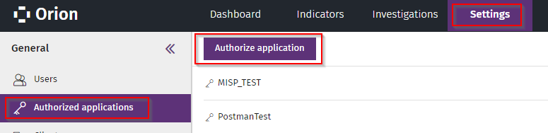
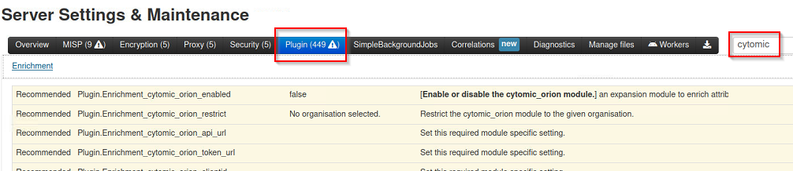

# Install MISP Server and connect to Watchguard Cytomic Orion EDR
This is a step by step tutorial to get startet with MISP and Cytomic Orion.<br>
Based on this [Post](https://www.vanimpe.eu/2020/03/10/integrating-misp-and-cytomic-orion/)
which made this possible - Thank you!<br>
There are also more Infos for MISP on [vanimpe.eu](https://www.vanimpe.eu/?s=misp&submit=Search).
Focus of these Infos are only to get a MISP Server running and connect it to Cytomic Orion; not<br>
how to secure the installation of misp or general security related things. There are also
some Infos<br> about hardening on the install script pages.

# Main goal & Status
Main goal of this is to get all relevant IOC data summarized via external feeds into misp and
upload these ioc's to cytomic orion - so if - an indicator matches you'll get an notfication and incident 
in Cytomic Orion. This is partially WIP.

| Info                                                    	| Status                 	|
|---------------------------------------------------------	|--------------------------	|
| Install MISP                 	| works                 	|
| Connect Orion                	| works 	|
| Upload IOCs to Orion                	| works 	|
| Right IOC TTLDays to Orion           	| works - see Change cytomic_orion.oy for right TTLDays	|
| Get notified if ioc is found               	| works  	|
| Delete IOCs from MISP in Orion                	| not working 	|
| Check which feeds to use                	| Todo 	|
| Cron for fetching feeds                	| Todo 	|
| Tag and publish Events automatically                	| Todo 	|


# Useful Links
* Cytomic Orion API for Postman/Jupyter [Link](https://info.cytomicmodel.com/resources/help/ORION/en/threathuntingAPI/index.htm)
* Cytomic Orion Postman ZIP Environment and Examples [Link](https://info.cytomicmodel.com/resources/guides/Orion/en/Postman.Orion.API.zip)
* MISP Github [Link](https://github.com/MISP/MISP)
* MISP Pymisp Github [Link](https://github.com/MISP/PyMISP)
* PYMISP Documentation [Link](https://pymisp.readthedocs.io/en/latest/)
* PYMISP Pypi [Link](https://pypi.org/project/pymisp/)

___

# Install MISP
First of all install MISP - here are some Installscripts for many supported<br>
Distros: [MISP Install Scripts](https://misp.github.io/MISP/). 
I went straight forward with Ubuntu 20.04 LTS.

___

## Configure MISP for Cytomic
After installing MISP and changing your password you can continue here.

### Enable Cytomic MISP Objects

1. Menu **Global Actions** > **List Object Templates** > left side **Update objects**
2. Menu **List Object Templates** > right side search for **cytomic** - two items should be active


___

### Enable Cytomic Taxonomy

1. Menu **Event Actions** > **List Taxonomies** > Left side **Update Taxonomies**
2. Menu **List Taxonomies** > right side search for **cytomic**
3. Enable via "play" Button

4. Enable all<br>


5. Double click on the item - check if both items are active.<br>
   These Tags are later used to mark an attribute or event for uploading oder deleting from Orion IOCs.<br>
   (Items/Events with TAG "upload" are sent to Cytomic IOCs | TAG "delete" are deleted from Cytomic - via cytomic_orion.py)<br>


___

### Create ORION API User / AUTH

For the sync between MISP and Orion you need some API credentials from Cytomic Orion.
You can add these in Orion under **Settings** > **Autorized applications**




___

### Enable Cytomic MISP Modul
These are the variables later used for the enrichment part as also for the **cytomic_orion.py** script
which is responsible for uploading/deleting events from MISP to Cytomic Orion.

1. Menu **Administration** > **Server Settings & Maintenance**
2. Top Menu > **Plugin**
3. Search on the right side for **cytomic** an click on **Plugin**
4. Fill the fields




Whilst using Watchguard Cytomic Orion - these are working examples:

| Field                                                    	| Value                 	|
|---------------------------------------------------------	|--------------------------	|
| Plugin.Enrichment_cytomic_orion_enabled                 	| set to True                 	|
| Plugin.Enrichment_cytomic_orion_restrict                	| Restrict to MISP Company 	|
| Plugin.Enrichment_cytomic_orion_api_url                 	| https://api.orion.cytomic.ai/api/v1/applications/                 	|
| Plugin.Enrichment_cytomic_orion_token_url               	| https://auth.pandasecurity.com/oauth/token                 	|
| Plugin.Enrichment_cytomic_orion_clientid                	| Copy values from Postman.Orion.API.zip clientid                   	|
| Plugin.Enrichment_cytomic_orion_clientsecret            	| Copy values Postman.Orion.API.zip secret                  	|
| Plugin.Enrichment_cytomic_orion_username                	| Orion > Settings > Authorized Applications - USERNAME                   	|
| Plugin.Enrichment_cytomic_orion_password                	| Orion > Settings > Authorized Applications - Password                      	|
| Plugin.Enrichment_cytomic_orion_upload_timeframe        	| 50 (Max Timestamp age of event to sync to Orion)                     	|
| Plugin.Enrichment_cytomic_orion_upload_tag              	| cytomic-orion:action="upload"                      	|
| Plugin.Enrichment_cytomic_orion_delete_tag              	| cytomic-orion:action="delete"                      	|
| Plugin.Enrichment_cytomic_orion_upload_ttlDays          	| 1000 ( INT in Days - Cytomic > Settings > IOCS > ***Expiration days***                     	|
| Plugin.Enrichment_cytomic_orion_upload_threat_level_id  	| 1 (INT threat level ID from MISP <=)                      	|
| Plugin.Enrichment_cytomic_orion_limit_upload_events     	| 100 (INT MAX limit event upload)                      	|
| Plugin.Enrichment_cytomic_orion_limit_upload_attributes 	| 100 (INT MAX limit attribut upload)                      	|	

___


### Create MISP-Server AUTH KEY ###
Later for **cytomic_orion.py** script to work - you need an **Authentication Key** which has to be set<br>
in the keys.py file - Infos where to put the key see **keys file - example folder**
Both files are located at: `/var/www/MISP/PyMISP/examples`

1. Menu > **Administration** > **List Auth Keys**
2. **Add authentication key**
3. Choose Username / Comments - maybe restrict access to some IP's and click submit
4. The Auth key is shown - copy this value
5. Next step -> key file


___

### keys file - example folder ###
To upload or delete files to Orion - we are using the **cytomic_orion.py** script which is located here:
`var/www/MISP/PyMISP/examples` - if you run this script without getting the **keys** file right,<br>
you will see this error message:

```
traceback (most recent call last):
File "cytomic_orion.py", line 20, in <module>
from keys import misp_url, misp_key, misp_verifycert
ModuleNotFoundError: No module named 'keys'
```
___

**Getting the Keys file right:**
More to pymisp [here](https://pypi.org/project/pymisp/)
In `var/www/MISP/PyMISP/examples` folder:

1. sudo cp keys.py.sample keys.py
2. sudo chown www-data:www-data keys.py
3. sudo nano keys.py
4. change **misp_url** to your url/hostname/ip or localhost
5. change **misp_key** to the key you've created above
6. change **misp_verifycert** to **False** ( unless you got your certs right )

___

### PYMISP ###

For me to fully work and call cytomic_orion.py without errors i had to also install **pymisp**<br>
via pip3 - if you see this Errormessage after running the script:
```
misp@misp:/var/www/MISP/PyMISP/examples$ python3 cytomic_orion.py 
Traceback (most recent call last):
File "cytomic_orion.py", line 19, in <module>
from pymisp import ExpandedPyMISP
ModuleNotFoundError: No module named 'pymisp'
```
you maybe also have to Install pymisp via pip3: **`pip3 install pymisp`**

___

## Use MISP / Cytomic ##

### First Test ###
If you are located at `/var/www/MISP/PyMISP/examples` and run 'python3 cytomic_orion.py --events' and get
the following output - you've done everything right:

```
As our baseline system is the latest Ubuntu LTS, and Ubuntu LTS 22.04 has Python 3.10 available,
we will officially deprecate python versions below 3.10 on January 1st 2024.
**Please update your codebase.**
  from pymisp import ExpandedPyMISP
Received access token
```
Received access token means you sucessfully authenticated to the Cytomic API. Calling the 
script --events would upload your events - but if no event has the tag "upload" it won't do anything.

___

## Add Event to MISP and use Enrichment from Cytomic

1. Menu > **Event Actions** > **Add Event**
2. Fill out the field and submit
3. In the event you have to add attributes at the bottom<br>
<br>

4. Fill out the fields - for example like this and submit<br>
<br>

5. Add a second attribute category *Network activity* and type *domain* (we'll need this later)<br>
<br>

6. **Activate the IDS checkmarks - if you do not activate them - these attributes will not get uploaded to cytomic!**

7. Click on the little star symbol on the md5 attribute **Propose Enrichment** and choose cytomic_orion<br>
**Notice:** The enrichment only works for **md5 values**!
<br>

8. See the results from your dataset. You'll get back fileinfos - if present and knwon in your Orion dataset<br>
like here the filename for this md5 hash. Second thing is you're getting back all machines this file was seen on.
<br>

___

## Upload IOCs from MISP to Cytomic IOC

Now we can upload the created event with this two attributes. After this both will be IOSs on Orion.

1. Menu > **Event Actions** > **List Events** > select your ID of the event you just added
2. Table > **Tags** add the cytomic upload tag and submit
<br>
3. Again - Check if the **IDS** checkmarks are active
4. Go back to **List Events** and **Publish Event** - events not published will not get uploaded by the script
<br>

5. Go back to Menu > **List Events** - should look like this - green checkmark for *is published* and upload tag
<br>

6. Now you could run the cytomic_orion.py script - `/var/www/MISP/PyMISP/examples$ python3 cytomic_orion.py --events`<br>
which will upload these elements as Cytomic IOCs. If everything works you should see something like this:
```
RESULT: {'httpStatusCode': 200, 'success': True, 'message': 'iocs: 1 FileHashIoc added.', 'error': None}
RESULT: {'httpStatusCode': 200, 'success': True, 'message': 'iocs: 1 DomainIoc added.', 'error': None}
Event: 2 hashs: 1 | domains: 1 (event untagged)
```

7. Check if you can see the IOCs in Orion **Settings** > **IOCs** <br>
**NOTICE** there is this **ttlDays** value from above which should be responsible how long the IOC<br>
should be valid and alert you if found - but in this case - it seems the script does not use<br>
the right api call to set this value. It tries to set it via a GET/POST `cytomicobj.atttype_cytomic + '?ttlDays='`
which won't work. The Cytomic Orion API expects this value in the json body with value **DaysToExpiration**.
Cause of this the TTL value is set to 0 in Orion - which will make the IOC inactive. So you won't get an alert for this.

<br>

**NOTICE** the script automatically untags your event - if you ever want to upload the event again, you have to retag it with cytomic-upload again!
___

## Change cytomic_orion.oy for right TTLDays

Change TTLdays in cytomic_orion.py
As mentioned above - if you change these two lines and run again - it should update the ttlDays.
I did not create a pull request because i am not sure - if the script creator and i / WG Cyt. Orion are
using 1to1 the same api.

Line 262 from
<pre>
cytomicobj.post_data = [{cytomicobj.attlabel_cytomic: post_value, 'AdditionalData': '{} {}'.format(cytomicobj.atttype_misp, attribute['comment']).strip(), 'Source': 'Uploaded from MISP', 'Policy': moduleconfig['cytomic_policy'], 'Description': '{} - {}'.format(event_id, event_title).strip()}]
</pre>
To
<pre>
cytomicobj.post_data = [{cytomicobj.attlabel_cytomic: post_value, 'AdditionalData': '{} {}'.format(cytomicobj.atttype_misp, attribute['comment']).strip(), 'DaysToExpiration': str(moduleconfig['upload_ttlDays']), 'Source': 'Uploaded from MISP', 'Policy': moduleconfig['cytomic_policy'], 'Description': '{} - {}'.format(event_id, event_title).strip()}]
</pre>

Line 265 from
<pre>
cytomicobj.post_data.append({cytomicobj.attlabel_cytomic: post_value, 'AdditionalData': '{} {}'.format(cytomicobj.atttype_misp, attribute['comment']).strip(), 'Source': 'Uploaded from MISP', 'Policy': moduleconfig['cytomic_policy'], 'Description': '{} - {}'.format(event_id, event_title).strip()})
</pre>

To
<pre>
cytomicobj.post_data.append({cytomicobj.attlabel_cytomic: post_value, 'AdditionalData': '{} {}'.format(cytomicobj.atttype_misp, attribute['comment']).strip(),'DaysToExpiration': str(moduleconfig['upload_ttlDays']), 'Source': 'Uploaded from MISP', 'Policy': moduleconfig['cytomic_policy'], 'Description': '{} - {}'.format(event_id, event_title).strip()})
</pre>

If you change these lines - **republish** your event and start the script again, the ttlDays should be updated in Orion.
___

## Delete IOCs from MISP in Orion

This should work - but unfortunately i could not get this running - have to have a closer look to this.


## Activate Streams


